# Отчёт по профилю жирных кислот и рациону

**Комплекс:** -  
**Период:** -  
**Дата отчёта:** 2025-10-08 21:55  

## Предсказанные жирные кислоты

| Кислота | Значение | Целевой коридор | Статус |
|---|---:|:---:|:---:|
| Лауриновая | 4.06% | 2.0 — 4.4 | в норме |
| Линолевая | 2.39% | 1.5 — 3.5 | в норме |
| Олеиновая | 22.45% | 22.0 — 28.0 | в норме |
| Пальмитиновая | 32.92% | 25.0 — 31.0 | высоко |
| Стеариновая | 8.16% | 8.0 — 12.5 | в норме |

## Важность факторов для кислот (↑ повышает, ↓ понижает)

### Лауриновая

| Фактор | Вес | Направление |
|:--|--:|:--:|
| однолетние травы | 0.11 | ↑ |
| соя | 0.07 | ↑ |
| тритикале | -0.06 | ↓ |
| ОЖК (%) | -0.05 | ↓ |
| K (%) | 0.05 | ↑ |
| ЧЭЛ 3x NRC (МДжоуль/кг) | -0.02 | ↓ |

### Линолевая

| Фактор | Вес | Направление |
|:--|--:|:--:|
| соя | -0.11 | ↓ |
| однолетние травы | 0.06 | ↑ |
| кукуруза | -0.03 | ↓ |
| ЧЭЛ 3x NRC (МДжоуль/кг) | 0.02 | ↑ |
| K (%) | -0.02 | ↓ |
| СП (%) | 0.01 | ↑ |

### Олеиновая

| Фактор | Вес | Направление |
|:--|--:|:--:|
| соя | -0.34 | ↓ |
| тритикале | 0.24 | ↑ |
| однолетние травы | -0.18 | ↓ |
| НВУ (%) | -0.15 | ↓ |
| люцерна | 0.07 | ↑ |
| СЖ (%) | 0.06 | ↑ |

### Пальмитиновая

| Фактор | Вес | Направление |
|:--|--:|:--:|
| соя | 0.59 | ↑ |
| ОЖК (%) | 0.23 | ↑ |
| тритикале | -0.23 | ↓ |
| CHO C uNDF (%) | 0.13 | ↑ |
| ячмень | -0.10 | ↓ |
| ЧЭЛ 3x NRC (МДжоуль/кг) | -0.09 | ↓ |

### Стеариновая

| Фактор | Вес | Направление |
|:--|--:|:--:|
| соя | -0.43 | ↓ |
| CHO C uNDF (%) | -0.22 | ↓ |
| однолетние травы | -0.21 | ↓ |
| тритикале | 0.19 | ↑ |
| ЧЭЛ 3x NRC (МДжоуль/кг) | 0.11 | ↑ |
| СЖ (%) | 0.07 | ↑ |

## Состав рациона (по % СВ)

| Ингредиент (оригинал) | Нормализовано | %СВ |
|---|---|---|
| Солома пшеничная ЛБ | солома | 1.00% |
| С-Ж 2262.05.10.01.1.24 / 05.01.25 | однолетние травы | 5.60% |
| С-Ж 2262.01.01.01.1.24 / 05.01.25 | люцерна | 5.60% |
| Жом свекловичный сухой. гр, ЭНАПКХ v2 | свекла | 5.20% |
| Кукуруза. 70%,сухая, мелк. помол, | кукуруза | 18.00% |
| Жмых рапсовый. 36%, ЭНАПКХ | рапс | 7.20% |
| Патока свекловичная, сах.49%, ЭНАПКХ | свекла | 5.20% |
| КК 10 От 17.09.24 ячмень | комбикорм | 12.00% |
| С-С 2262.04.05.02.1.24 / СР | кукуруза | 27.40% |

## Что увеличить/снизить для изменения нутриентов

**K (%)**
_Чтобы повысить:_
- свекла (вес 0.02)
- кукуруза (вес 0.01)
- ячмень (вес 0.01)
_Что обычно снижает:_
- соя (вес -0.03)
- солома (вес -0.01)
- люцерна (вес -0.01)

**aNDFom фуража (%)**
_Чтобы повысить:_
- соя (вес 6.93)
- концентраты (вес 0.16)
- ячмень (вес 0.13)
_Что обычно снижает:_
- однолетние травы (вес -0.36)
- солома (вес -0.29)
- свекла (вес -0.21)

**СЖ (%)**
_Чтобы повысить:_
- однолетние травы (вес 0.09)
- тритикале (вес 0.07)
- люцерна (вес 0.05)
_Что обычно снижает:_
- соя (вес -0.20)
- концентраты (вес -0.03)
- луговые травы (вес -0.01)

**Растворимая клетчатка (%)**
_Чтобы повысить:_
- свекла (вес 0.16)
- тритикале (вес 0.04)
- ячмень (вес 0.03)
_Что обычно снижает:_
- соя (вес -0.91)
- комбикорм (вес -0.10)
- концентраты (вес -0.02)

**Крахмал (%)**
_Чтобы повысить:_
- солома (вес 0.23)
- рапс (вес 0.10)
- люцерна (вес 0.09)
_Что обычно снижает:_
- соя (вес -2.75)
- концентраты (вес -0.19)
- комбикорм (вес -0.18)

**peNDF (%)**
_Чтобы повысить:_
- тритикале (вес 1.35)
- соя (вес 0.68)
- рапс (вес 0.56)
_Что обычно снижает:_
- люцерна (вес -0.15)
- сено (вес -0.13)
- кукуруза (вес -0.11)

**aNDFom (%)**
_Чтобы повысить:_
- соя (вес 6.09)
- концентраты (вес 0.14)
- комбикорм (вес 0.05)
_Что обычно снижает:_
- свекла (вес -0.42)
- однолетние травы (вес -0.30)
- солома (вес -0.08)

**ЧЭЛ 3x NRC (МДжоуль/кг)**
_Чтобы повысить:_
- свекла (вес 0.05)
- однолетние травы (вес 0.03)
- солома (вес 0.02)
_Что обычно снижает:_
- соя (вес -0.35)
- концентраты (вес -0.01)

**Сахар (ВРУ) (%)**
_Чтобы повысить:_
- свекла (вес 0.22)
- кукуруза (вес 0.17)
- люцерна (вес 0.08)
_Что обычно снижает:_
- тритикале (вес -0.08)
- соя (вес -0.03)
- рапс (вес -0.02)

**ОЖК (%)**
_Чтобы повысить:_
- однолетние травы (вес 0.07)
- свекла (вес 0.06)
- тритикале (вес 0.04)
_Что обычно снижает:_
- соя (вес -0.42)
- концентраты (вес -0.04)
- рапс (вес -0.02)

**НВУ (%)**
_Чтобы повысить:_
- однолетние травы (вес 0.24)
- свекла (вес 0.18)
- кукуруза (вес 0.06)
_Что обычно снижает:_
- соя (вес -3.50)
- рапс (вес -0.05)
- комбикорм (вес -0.04)

**CHO C uNDF (%)**
_Чтобы повысить:_
- соя (вес 1.68)
- концентраты (вес 0.02)
_Что обычно снижает:_
- однолетние травы (вес -0.36)
- свекла (вес -0.26)
- люцерна (вес -0.06)

**СП (%)**
_Чтобы повысить:_
- однолетние травы (вес 0.02)
- свекла (вес 0.01)
- кукуруза (вес 0.01)
_Что обычно снижает:_
- соя (вес -0.60)
- концентраты (вес -0.02)

## Прочие графики

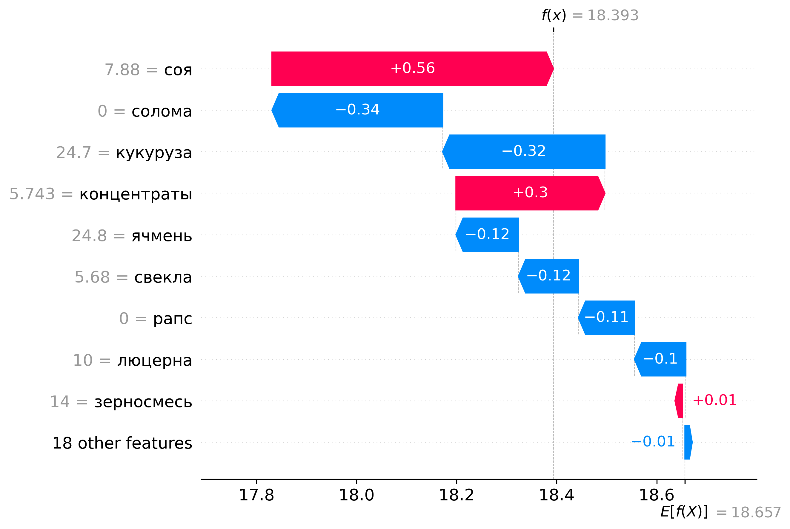

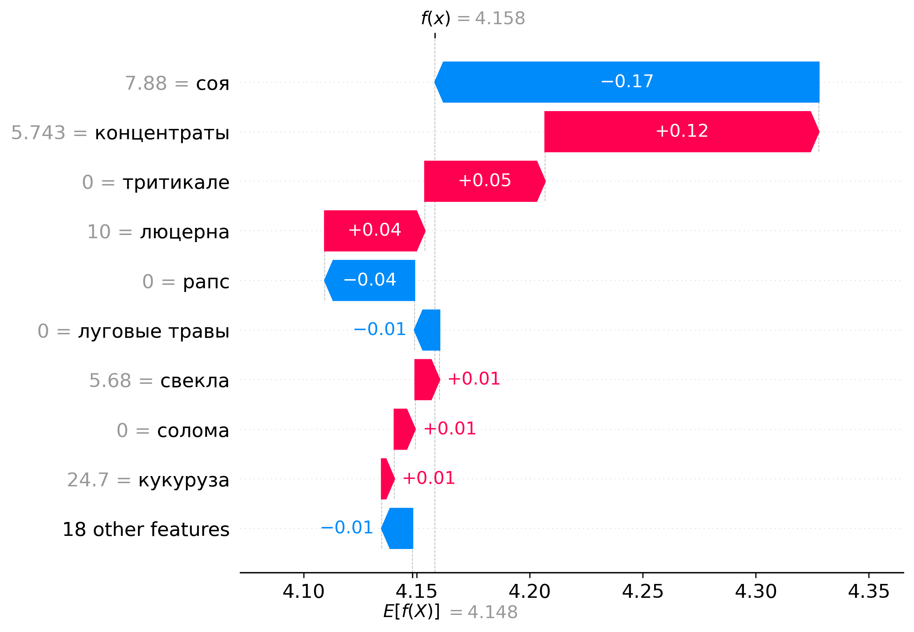

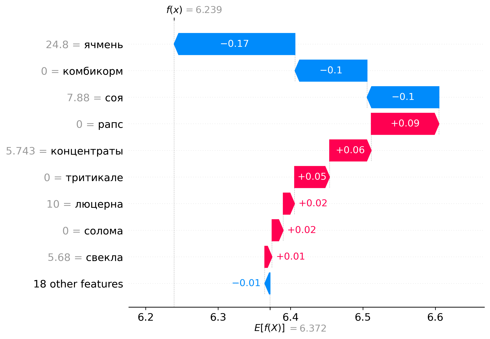

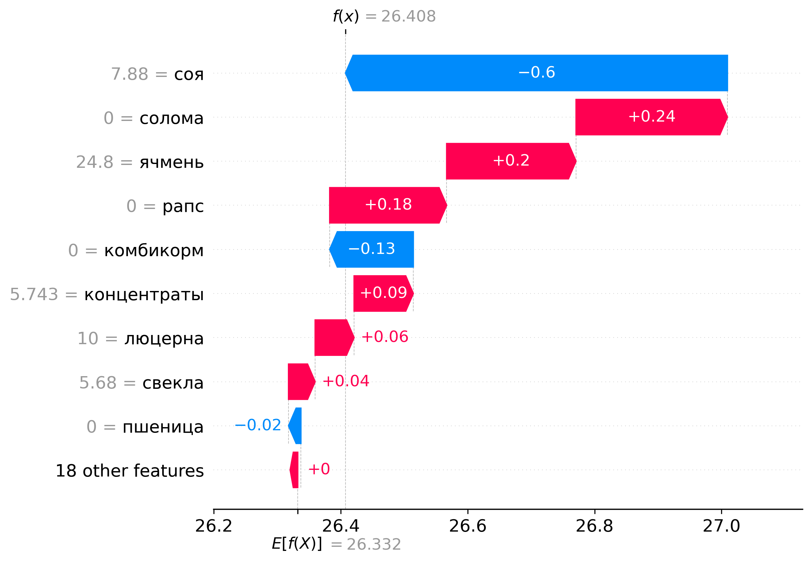

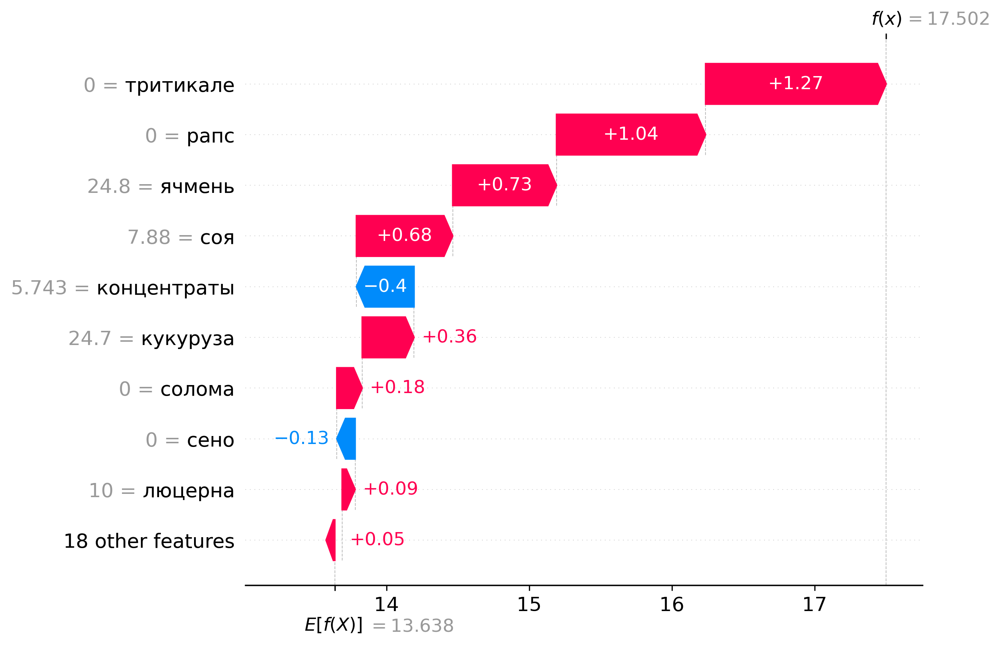

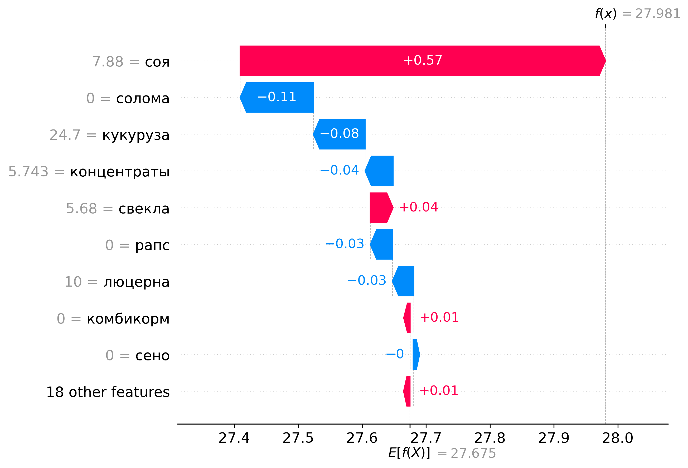

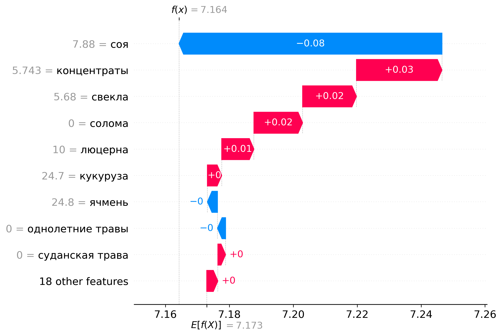

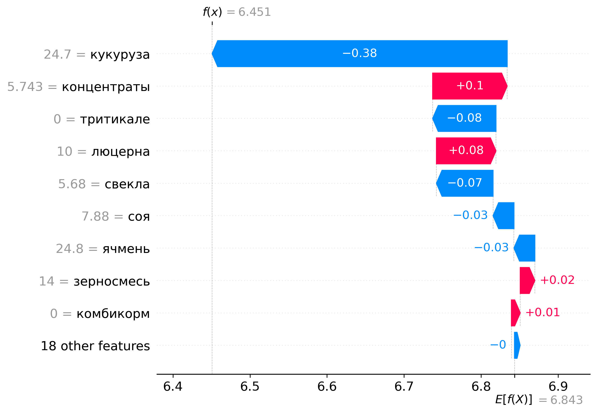

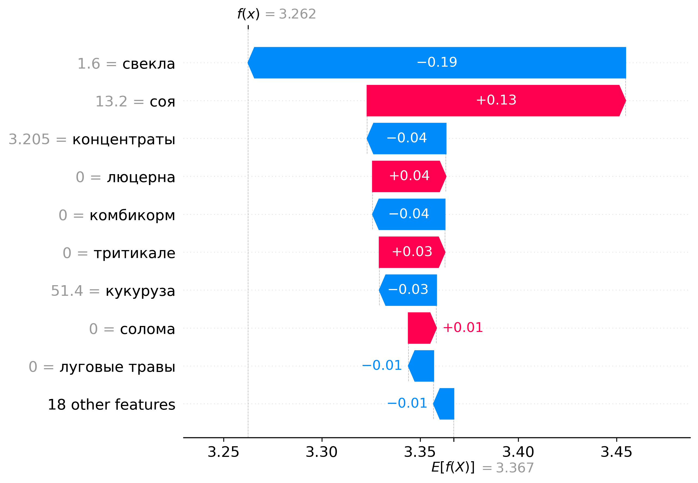

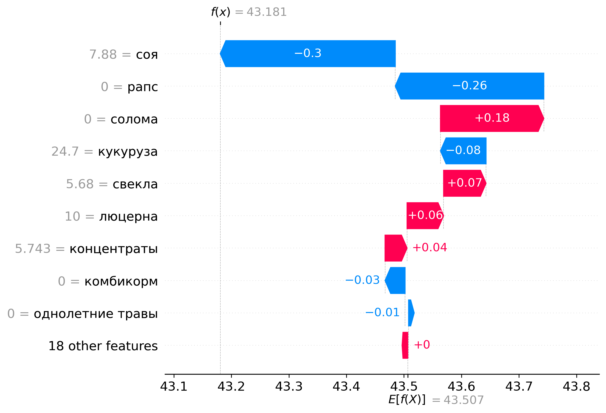

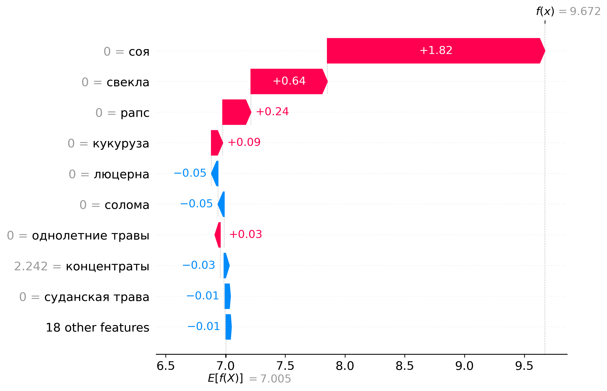

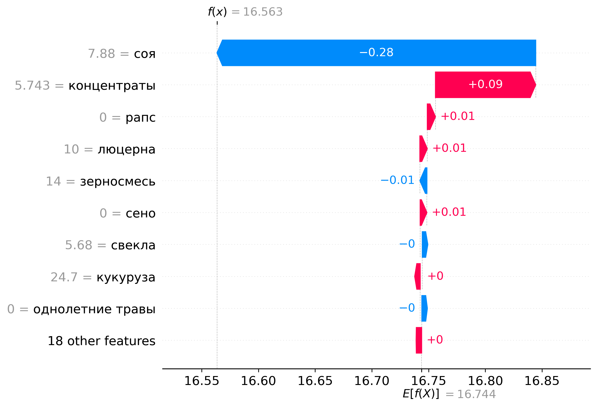

> Дисклеймер: рекомендации/веса — модельные ориентиры. Перед изменениями проверяйте баланс СП/Энергии, крахмала, NDF, минералов и ограничений по жирам.
