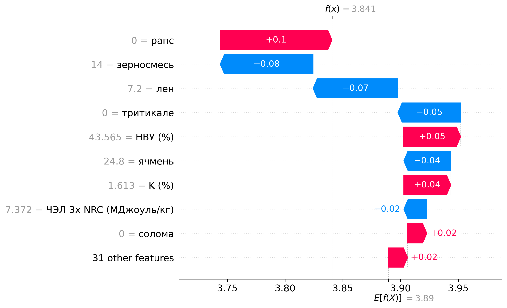
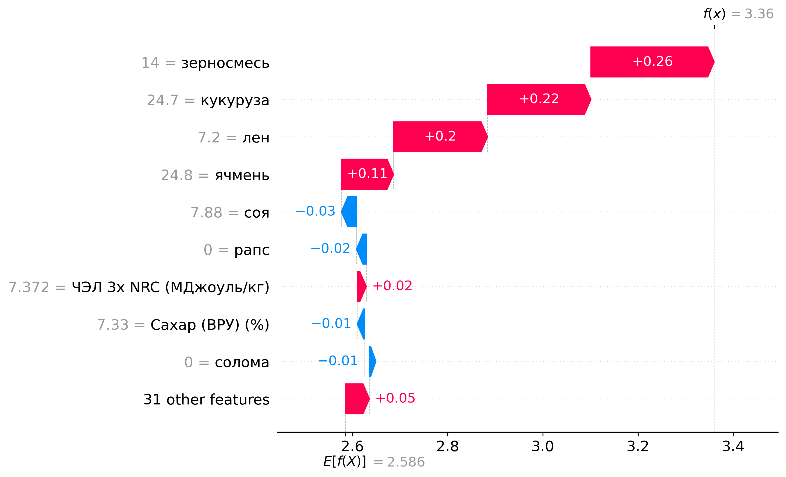
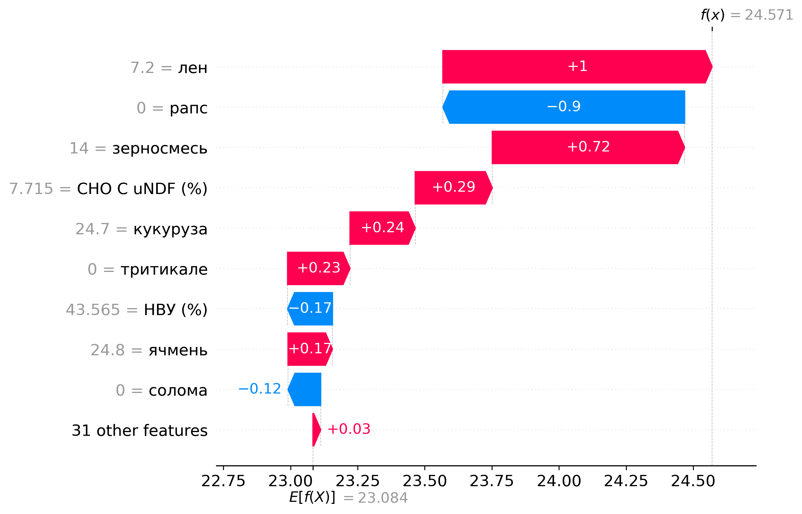
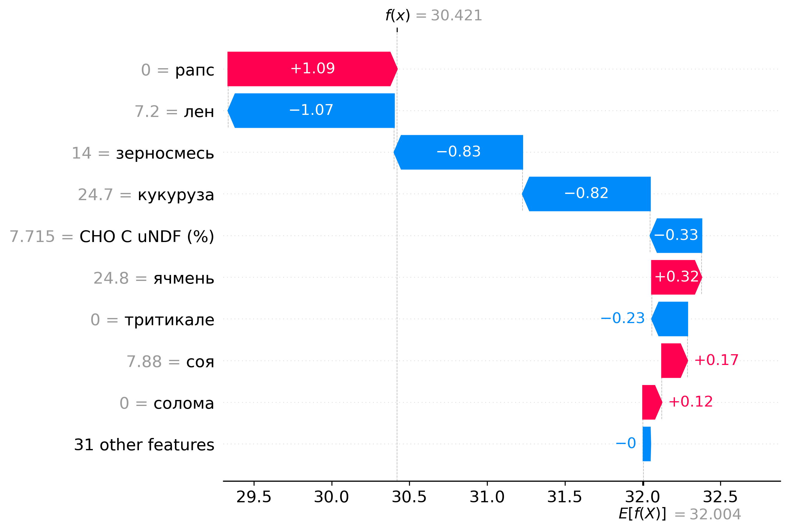
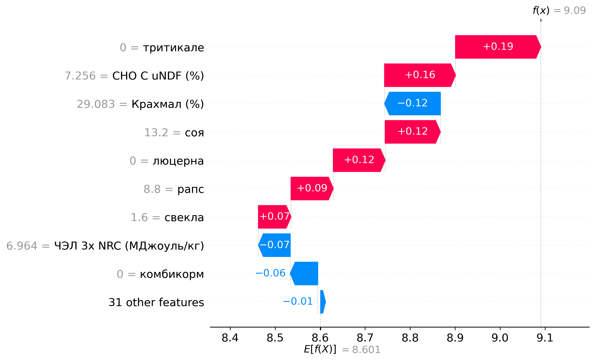

# Отчёт по профилю жирных кислот и рациону

**Комплекс:** -  
**Период:** -  
**Дата отчёта:** 2025-10-08 19:16  

## Важность рациона для жирных кислот (графики)

**Лауриновая**  

**Линолевая**  

**Олеиновая**  

**Пальмитиновая**  

**Стеариновая**  

## Предсказанные жирные кислоты

| Кислота | Значение | Целевой коридор | Статус |
|---|---:|:---:|:---:|
| Лауриновая | 3.84% | 2.0 — 4.4 | в норме |
| Линолевая | 3.36% | 1.5 — 3.5 | в норме |
| Олеиновая | 24.57% | 22.0 — 28.0 | в норме |
| Пальмитиновая | 30.42% | 25.0 — 31.0 | в норме |
| Стеариновая | 9.46% | 8.0 — 12.5 | в норме |

## Важность факторов для кислот (↑ повышает, ↓ понижает)

### Лауриновая

| Фактор | Вес | Направление |
|:--|--:|:--:|
| рапс | 0.10 | ↑ |
| зерносмесь | -0.08 | ↓ |
| лен | -0.07 | ↓ |
| тритикале | -0.05 | ↓ |
| НВУ (%) | 0.05 | ↑ |
| K (%) | 0.04 | ↑ |

### Линолевая

| Фактор | Вес | Направление |
|:--|--:|:--:|
| зерносмесь | 0.26 | ↑ |
| кукуруза | 0.22 | ↑ |
| лен | 0.20 | ↑ |
| соя | -0.03 | ↓ |
| рапс | -0.02 | ↓ |
| Сахар (ВРУ) (%) | -0.01 | ↓ |

### Олеиновая

| Фактор | Вес | Направление |
|:--|--:|:--:|
| лен | 1.00 | ↑ |
| рапс | -0.90 | ↓ |
| зерносмесь | 0.72 | ↑ |
| CHO C uNDF (%) | 0.29 | ↑ |
| НВУ (%) | -0.17 | ↓ |
| солома | -0.12 | ↓ |

### Пальмитиновая

| Фактор | Вес | Направление |
|:--|--:|:--:|
| рапс | 1.09 | ↑ |
| лен | -1.07 | ↓ |
| зерносмесь | -0.83 | ↓ |
| кукуруза | -0.82 | ↓ |
| ячмень | 0.32 | ↑ |
| соя | 0.17 | ↑ |

### Стеариновая

| Фактор | Вес | Направление |
|:--|--:|:--:|
| лен | 0.48 | ↑ |
| рапс | -0.46 | ↓ |
| зерносмесь | 0.46 | ↑ |
| CHO C uNDF (%) | 0.20 | ↑ |
| соя | -0.11 | ↓ |
| ячмень | -0.09 | ↓ |

## Состав рациона (по % СВ)

| Ингредиент (оригинал) | Нормализовано | %СВ |
|---|---|---|
| Кукуруза. 70%,сухая, мелк. | кукуруза | 16.00% |
| Ячмень. сухой 53%, средний | ячмень | 24.80% |
| Шрот соевый. 49%, ЭНАПКХ | соя | 7.88% |
| Жмых льняной. 36%, ЭНАПКХ | лен | 7.20% |
| Патока свекловичная, сахар | свекла | 5.68% |
| Жир защищенный. 99%, | концентраты | 1.40% |
| Мел. ЭНАПКХ | концентраты | 1.00% |
| Премикс дойный Б. 09.22 | концентраты | 0.60% |
| Сода. ЭНАПКХ | концентраты | 0.76% |
| Поташ. ЭНАПКХ | концентраты | 0.36% |
| Соль. ЭНАПКХ | концентраты | 0.42% |
| Пивные дрожжи сухие | концентраты | 1.20% |
| 6110.09.05.02.1.24/29.04.25 | кукуруза | 8.70% |
| 6110.10.18.01.1.24 / 02.07.25 | зерносмесь | 14.00% |
| 6110.01.01.01.1.24 люцерна | люцерна | 10.00% |

## Что увеличить/снизить для изменения нутриентов

**K (%)**
_Чтобы повысить:_
- рапс (вес 0.01)
_Что обычно снижает:_
- кукуруза (вес -0.01)
- солома (вес -0.01)
- свекла (вес -0.01)

**aNDFom фуража (%)**
_Чтобы повысить:_
- соя (вес 0.56)
- концентраты (вес 0.30)
- зерносмесь (вес 0.01)
_Что обычно снижает:_
- солома (вес -0.34)
- кукуруза (вес -0.32)
- ячмень (вес -0.12)

**СЖ (%)**
_Чтобы повысить:_
- концентраты (вес 0.12)
- тритикале (вес 0.05)
- люцерна (вес 0.04)
_Что обычно снижает:_
- соя (вес -0.17)
- рапс (вес -0.04)
- луговые травы (вес -0.01)

**Растворимая клетчатка (%)**
_Чтобы повысить:_
- рапс (вес 0.09)
- концентраты (вес 0.06)
- тритикале (вес 0.05)
_Что обычно снижает:_
- ячмень (вес -0.17)
- комбикорм (вес -0.10)
- соя (вес -0.10)

**Крахмал (%)**
_Чтобы повысить:_
- солома (вес 0.24)
- ячмень (вес 0.20)
- рапс (вес 0.18)
_Что обычно снижает:_
- соя (вес -0.60)
- комбикорм (вес -0.13)
- пшеница (вес -0.02)

**peNDF (%)**
_Чтобы повысить:_
- тритикале (вес 1.27)
- рапс (вес 1.04)
- ячмень (вес 0.73)
_Что обычно снижает:_
- концентраты (вес -0.40)
- сено (вес -0.13)
- комбикорм (вес -0.03)

**aNDFom (%)**
_Чтобы повысить:_
- соя (вес 0.57)
- свекла (вес 0.04)
- комбикорм (вес 0.01)
_Что обычно снижает:_
- солома (вес -0.11)
- кукуруза (вес -0.08)
- концентраты (вес -0.04)

**ЧЭЛ 3x NRC (МДжоуль/кг)**
_Чтобы повысить:_
- концентраты (вес 0.03)
- свекла (вес 0.02)
- солома (вес 0.02)
_Что обычно снижает:_
- соя (вес -0.08)

**Сахар (ВРУ) (%)**
_Чтобы повысить:_
- концентраты (вес 0.10)
- люцерна (вес 0.08)
- зерносмесь (вес 0.02)
_Что обычно снижает:_
- кукуруза (вес -0.38)
- тритикале (вес -0.08)
- свекла (вес -0.07)

**ОЖК (%)**
_Чтобы повысить:_
- концентраты (вес 0.12)
- люцерна (вес 0.03)
- тритикале (вес 0.03)
_Что обычно снижает:_
- соя (вес -0.32)
- рапс (вес -0.02)
- комбикорм (вес -0.02)

**НВУ (%)**
_Чтобы повысить:_
- солома (вес 0.18)
- свекла (вес 0.07)
- люцерна (вес 0.06)
_Что обычно снижает:_
- соя (вес -0.30)
- рапс (вес -0.26)
- кукуруза (вес -0.08)

**CHO C uNDF (%)**
_Чтобы повысить:_
- соя (вес 0.75)
- рапс (вес 0.24)
- зерносмесь (вес 0.04)
_Что обычно снижает:_
- свекла (вес -0.06)
- солома (вес -0.06)
- люцерна (вес -0.05)

**СП (%)**
_Чтобы повысить:_
- концентраты (вес 0.09)
- рапс (вес 0.01)
- люцерна (вес 0.01)
_Что обычно снижает:_
- соя (вес -0.28)
- зерносмесь (вес -0.01)

## Прочие графики

> Дисклеймер: рекомендации/веса — модельные ориентиры. Перед изменениями проверяйте баланс СП/Энергии, крахмала, NDF, минералов и ограничений по жирам.
