# Отчёт по профилю жирных кислот и рациону

**Комплекс:** -  
**Период:** -  
**Дата отчёта:** 2025-10-08 15:42  

## Важность рациона для жирных кислот (графики)

**Лауриновая**  
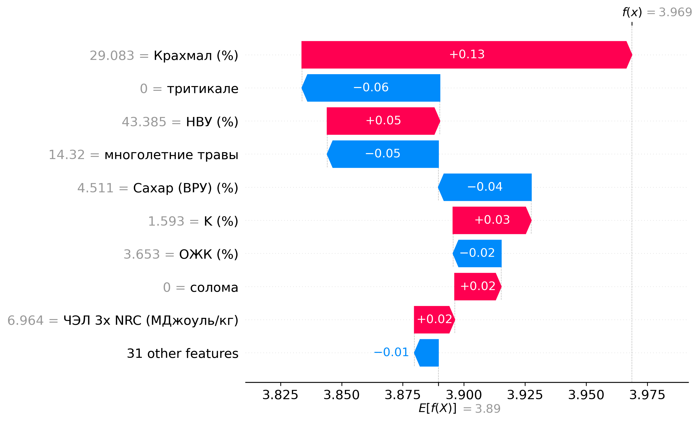

**Линолевая**  
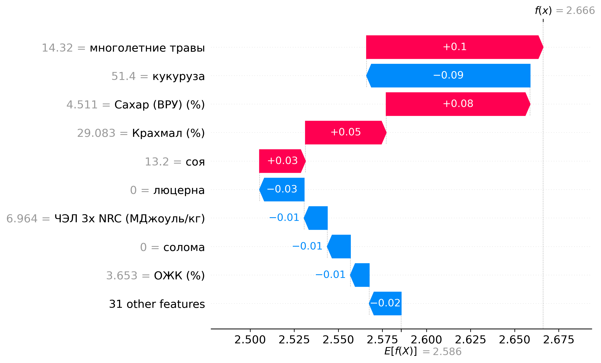

**Олеиновая**  
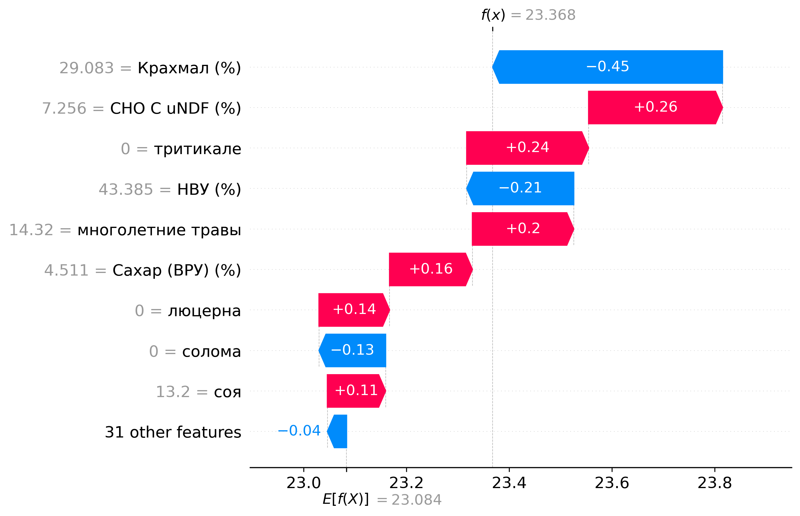

**Пальмитиновая**  
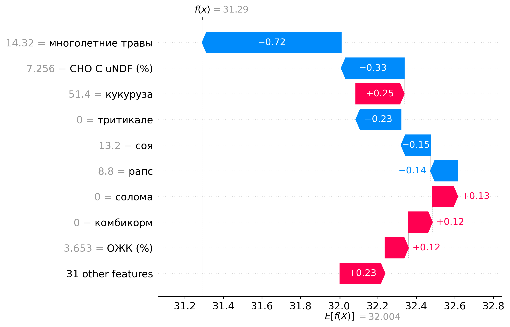

**Стеариновая**  
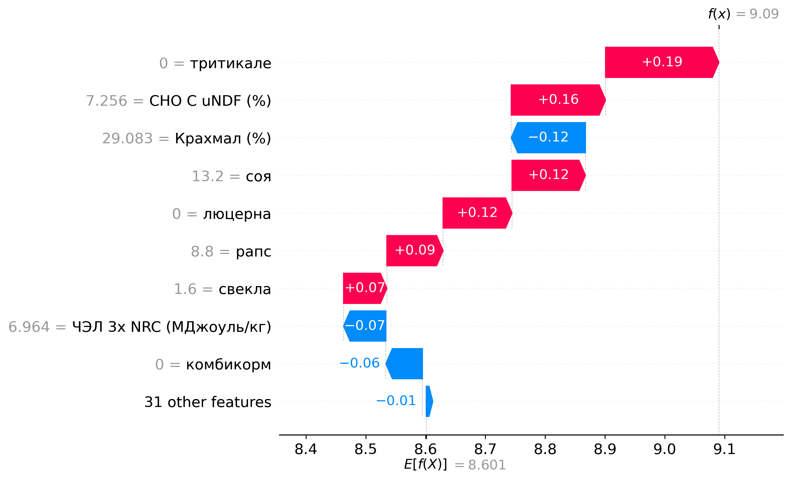

## Предсказанные жирные кислоты

| Кислота | Значение | Целевой коридор | Статус |
|---|---:|:---:|:---:|
| Лауриновая | 3.97% | 2.0 — 4.4 | в норме |
| Линолевая | 2.67% | 1.5 — 3.5 | в норме |
| Олеиновая | 23.37% | 22.0 — 28.0 | в норме |
| Пальмитиновая | 31.29% | 25.0 — 31.0 | высоко |
| Стеариновая | 9.09% | 8.0 — 12.5 | в норме |

## Важность факторов для кислот (↑ повышает, ↓ понижает)

### Лауриновая

| Фактор | Вес | Направление |
|:--|--:|:--:|
| Крахмал (%) | 0.13 | ↑ |
| тритикале | -0.06 | ↓ |
| НВУ (%) | 0.05 | ↑ |
| многолетние травы | -0.05 | ↓ |
| Сахар (ВРУ) (%) | -0.04 | ↓ |
| K (%) | 0.03 | ↑ |

### Линолевая

| Фактор | Вес | Направление |
|:--|--:|:--:|
| многолетние травы | 0.10 | ↑ |
| кукуруза | -0.09 | ↓ |
| Сахар (ВРУ) (%) | 0.08 | ↑ |
| Крахмал (%) | 0.05 | ↑ |
| люцерна | -0.03 | ↓ |
| ЧЭЛ 3x NRC (МДжоуль/кг) | -0.01 | ↓ |

### Олеиновая

| Фактор | Вес | Направление |
|:--|--:|:--:|
| Крахмал (%) | -0.45 | ↓ |
| CHO C uNDF (%) | 0.26 | ↑ |
| тритикале | 0.24 | ↑ |
| НВУ (%) | -0.21 | ↓ |
| многолетние травы | 0.20 | ↑ |
| солома | -0.13 | ↓ |

### Пальмитиновая

| Фактор | Вес | Направление |
|:--|--:|:--:|
| многолетние травы | -0.72 | ↓ |
| CHO C uNDF (%) | -0.33 | ↓ |
| кукуруза | 0.25 | ↑ |
| тритикале | -0.23 | ↓ |
| солома | 0.13 | ↑ |
| комбикорм | 0.12 | ↑ |

### Стеариновая

| Фактор | Вес | Направление |
|:--|--:|:--:|
| тритикале | 0.19 | ↑ |
| CHO C uNDF (%) | 0.16 | ↑ |
| Крахмал (%) | -0.12 | ↓ |
| соя | 0.12 | ↑ |
| ЧЭЛ 3x NRC (МДжоуль/кг) | -0.07 | ↓ |
| комбикорм | -0.06 | ↓ |

## Состав рациона (по % СВ)

| Ингредиент (оригинал) | Нормализовано | %СВ |
|---|---|---|
| 5701.01.05.1.23 /19.09.2024 | кукуруза | 12.00% |
| 5210.03.03.01.1.24 /23.05.2025 | многолетние травы | 14.32% |
| 5210.07.05.02.1.24 /23.05.2025 | кукуруза | 22.00% |
| Шрот соевый. 47%, ЭНАПКХ | соя | 13.20% |
| Шрот рапсовый. 41%, ЭНАПКХ | рапс | 8.80% |
| Кукуруза. 65%,сухая средн. | кукуруза | 17.40% |
| Жом свекловичный сухой. | свекла | 1.60% |
| Соль. ЭНАПКХ | концентраты | 0.48% |
| Жир защищеный. 99%, | концентраты | 1.16% |
| Премикс дойный Б. 09.22 | концентраты | 0.60% |
| Поташ. ЭНАПКХ | концентраты | 0.56% |
| Добавка ЛЕД ЭНАПКХ | концентраты | 0.40% |

## Что увеличить/снизить для изменения нутриентов

**K (%)**
_Чтобы повысить:_
- соя (вес 0.03)
- ячмень (вес 0.01)
_Что обычно снижает:_
- кукуруза (вес -0.05)
- концентраты (вес -0.01)
- свекла (вес -0.01)

**aNDFom фуража (%)**
_Чтобы повысить:_
- кукуруза (вес 0.76)
- свекла (вес 0.62)
- ячмень (вес 0.08)
_Что обычно снижает:_
- соя (вес -0.67)
- солома (вес -0.29)
- люцерна (вес -0.15)

**СЖ (%)**
_Чтобы повысить:_
- соя (вес 0.07)
- тритикале (вес 0.07)
- люцерна (вес 0.05)
_Что обычно снижает:_
- свекла (вес -0.15)
- концентраты (вес -0.08)
- кукуруза (вес -0.02)

**Растворимая клетчатка (%)**
_Чтобы повысить:_
- соя (вес 0.14)
- ячмень (вес 0.09)
- тритикале (вес 0.05)
_Что обычно снижает:_
- свекла (вес -0.25)
- комбикорм (вес -0.12)
- рапс (вес -0.04)

**Крахмал (%)**
_Чтобы повысить:_
- солома (вес 0.31)
- рапс (вес 0.21)
- концентраты (вес 0.20)
_Что обычно снижает:_
- комбикорм (вес -0.16)
- ячмень (вес -0.13)
- пшеница (вес -0.02)

**peNDF (%)**
_Чтобы повысить:_
- тритикале (вес 1.45)
- кукуруза (вес 0.90)
- рапс (вес 0.46)
_Что обычно снижает:_
- концентраты (вес -0.24)
- люцерна (вес -0.15)
- соя (вес -0.14)

**aNDFom (%)**
_Чтобы повысить:_
- свекла (вес 0.74)
- кукуруза (вес 0.45)
- рапс (вес 0.03)
_Что обычно снижает:_
- соя (вес -0.75)
- солома (вес -0.08)
- люцерна (вес -0.02)

**ЧЭЛ 3x NRC (МДжоуль/кг)**
_Чтобы повысить:_
- соя (вес 0.06)
- солома (вес 0.02)
- люцерна (вес 0.01)
_Что обычно снижает:_
- свекла (вес -0.10)
- кукуруза (вес -0.03)

**Сахар (ВРУ) (%)**
_Чтобы повысить:_
- кукуруза (вес 0.17)
- люцерна (вес 0.08)
- соя (вес 0.02)
_Что обычно снижает:_
- свекла (вес -1.18)
- тритикале (вес -0.08)
- многолетние травы (вес -0.06)

**ОЖК (%)**
_Чтобы повысить:_
- соя (вес 0.13)
- люцерна (вес 0.04)
- тритикале (вес 0.03)
_Что обычно снижает:_
- свекла (вес -0.19)
- концентраты (вес -0.04)
- комбикорм (вес -0.04)

**НВУ (%)**
_Чтобы повысить:_
- соя (вес 0.34)
- солома (вес 0.14)
- люцерна (вес 0.04)
_Что обычно снижает:_
- свекла (вес -0.88)
- комбикорм (вес -0.04)

**CHO C uNDF (%)**
_Чтобы повысить:_
- свекла (вес 0.63)
- кукуруза (вес 0.07)
- однолетние травы (вес 0.02)
_Что обычно снижает:_
- соя (вес -0.24)
- солома (вес -0.08)
- люцерна (вес -0.06)

**СП (%)**
_Чтобы повысить:_
- соя (вес 0.10)
- рапс (вес 0.02)
- свекла (вес 0.02)
_Что обычно снижает:_
- кукуруза (вес -0.01)
- концентраты (вес -0.01)

## Прочие графики

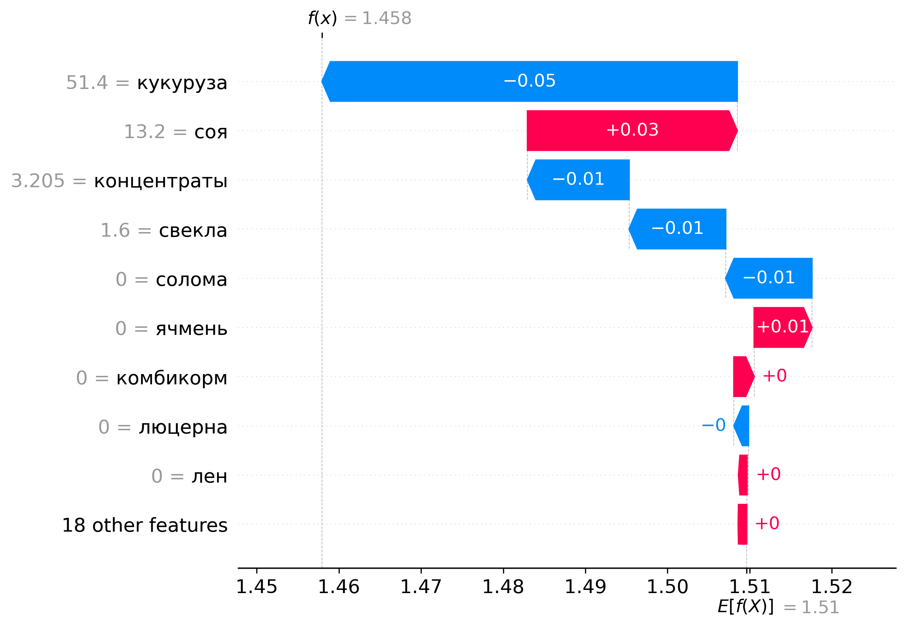

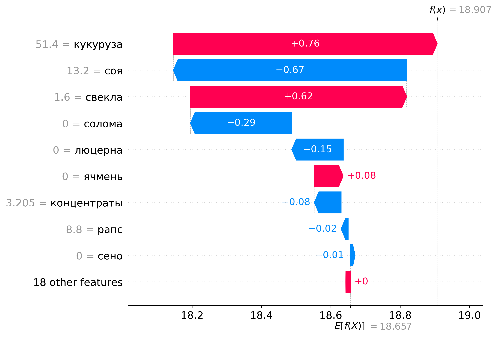

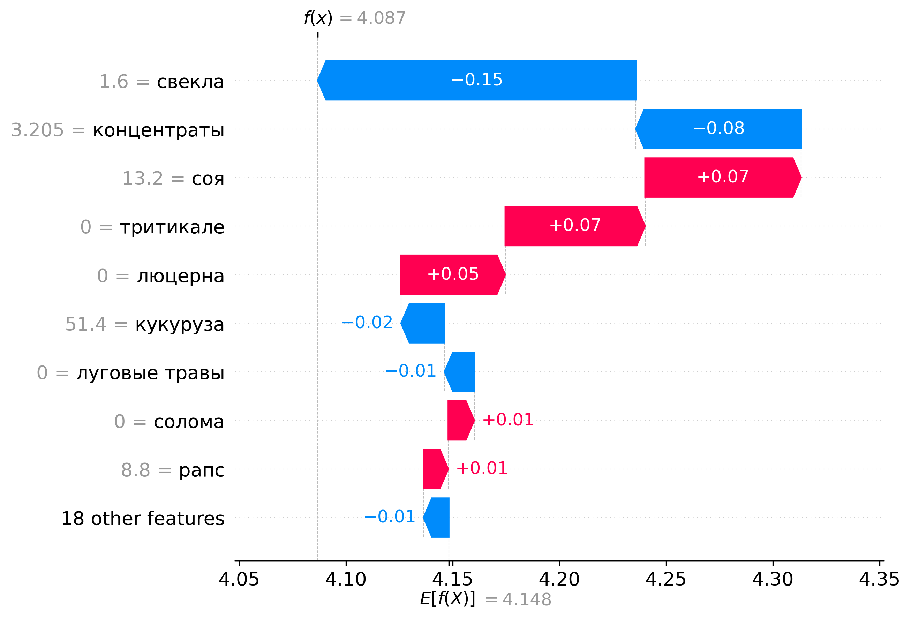

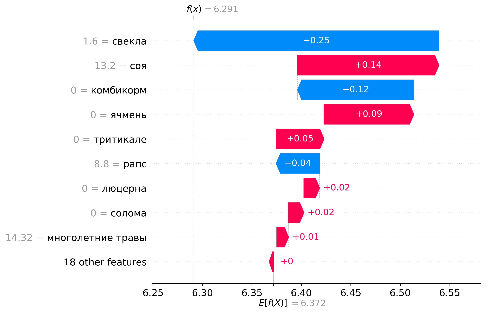

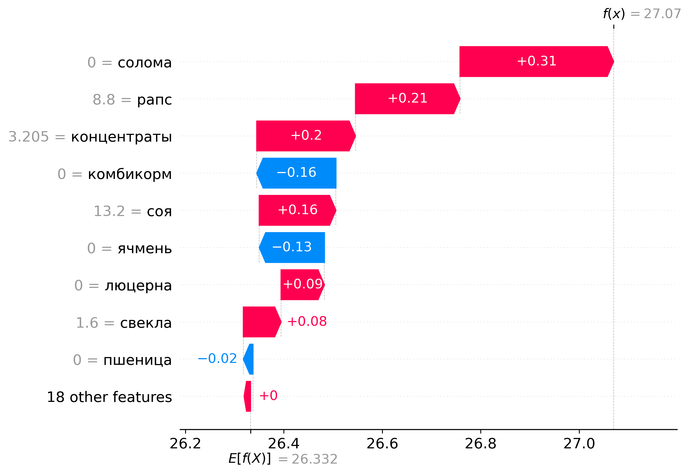

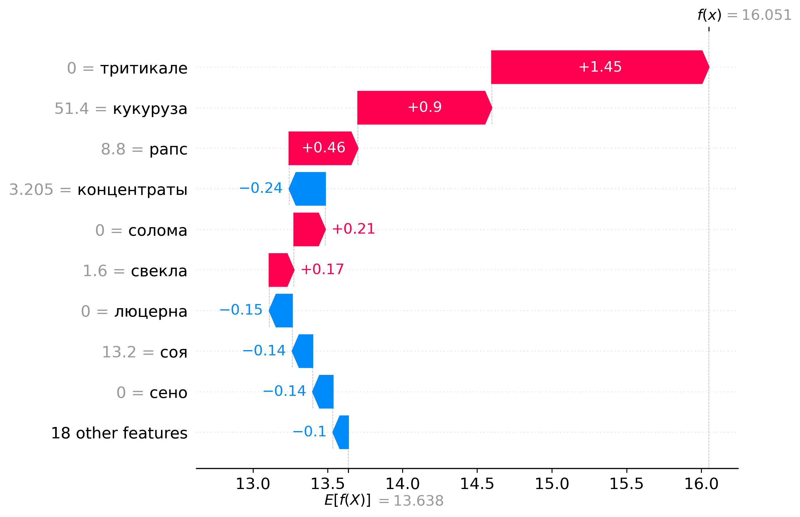

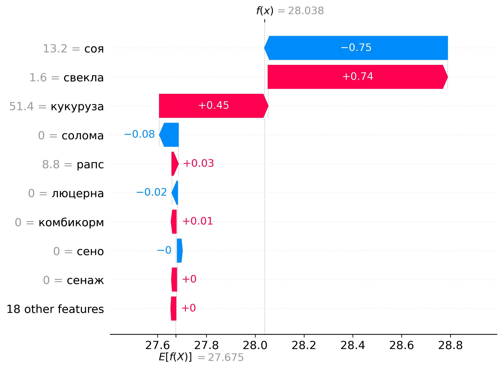

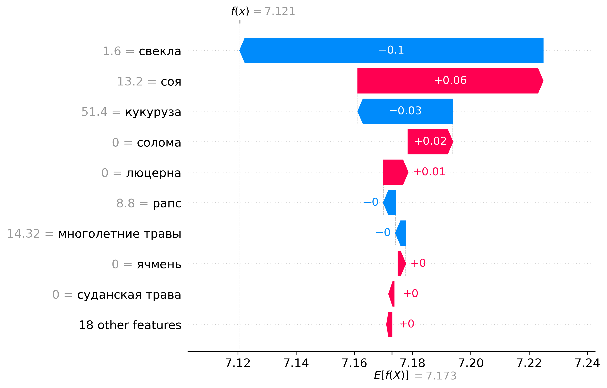

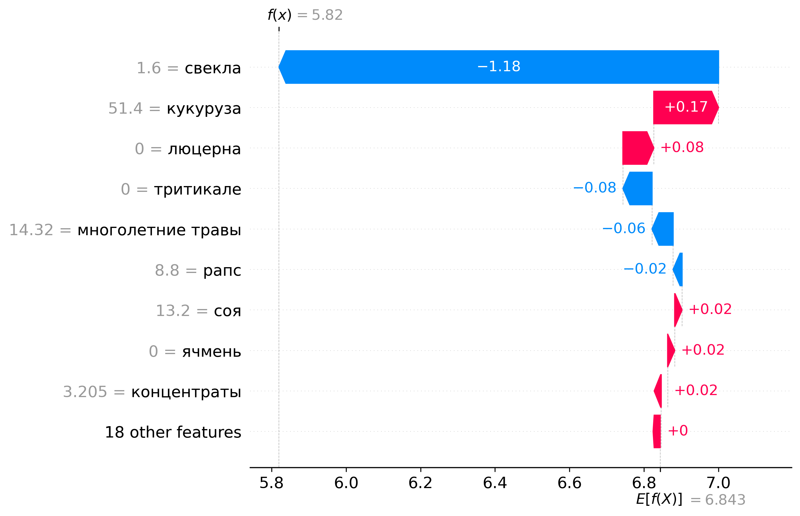

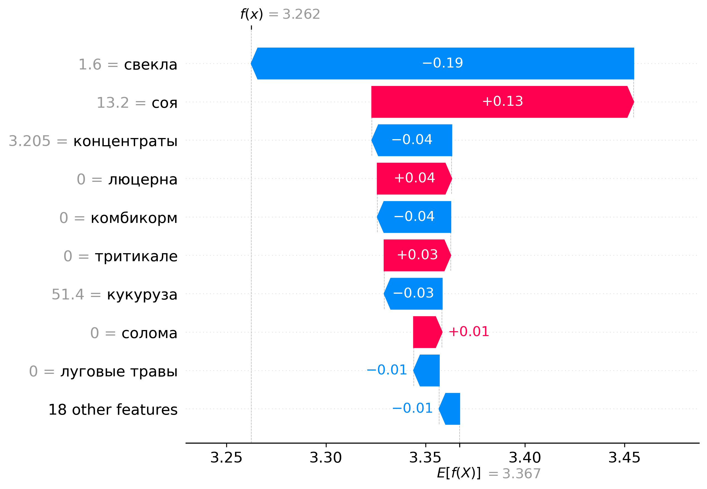

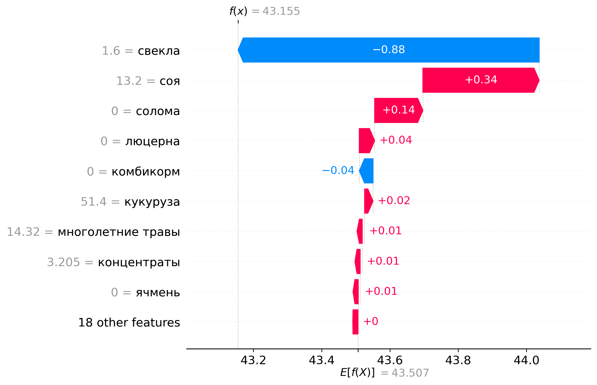

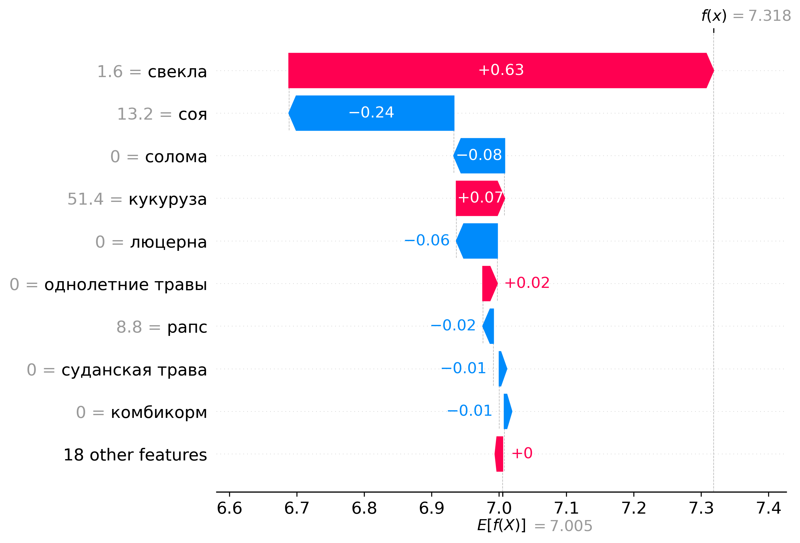

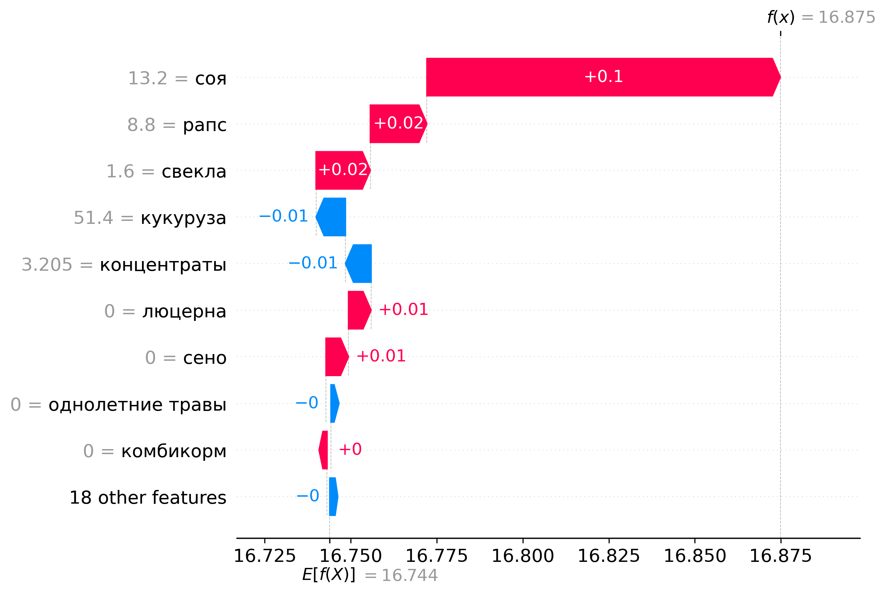

> Дисклеймер: рекомендации/веса — модельные ориентиры. Перед изменениями проверяйте баланс СП/Энергии, крахмала, NDF, минералов и ограничений по жирам.
